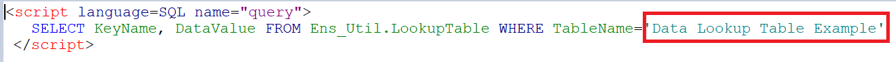
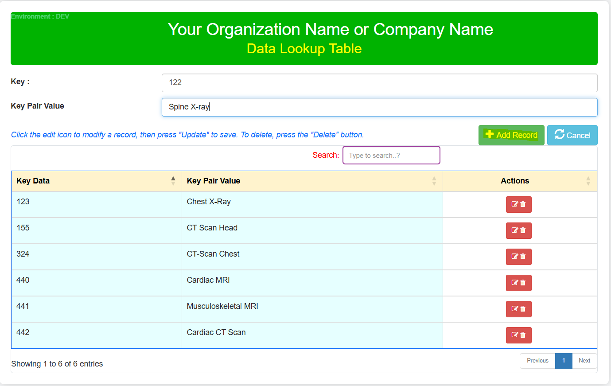
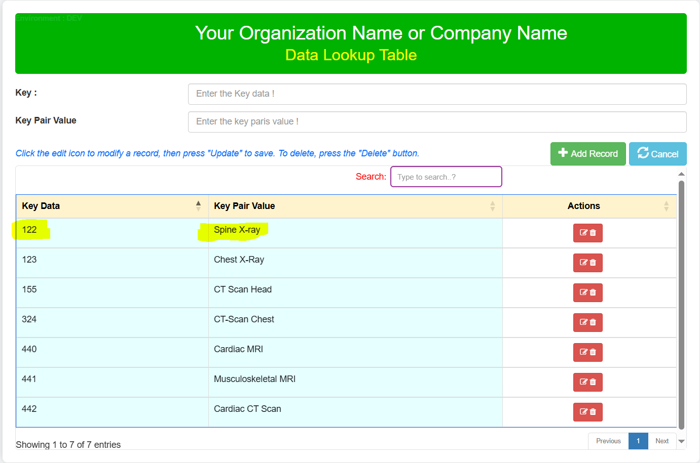
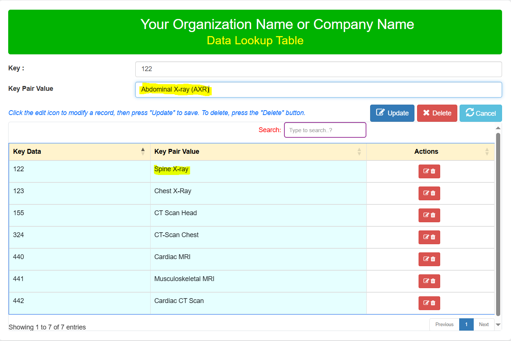
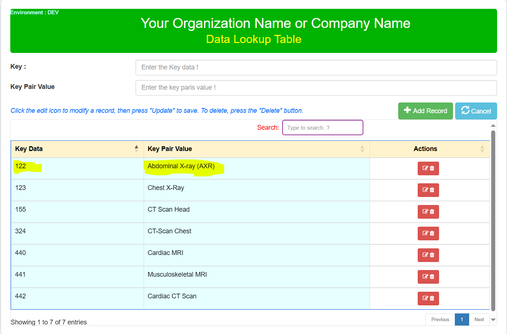
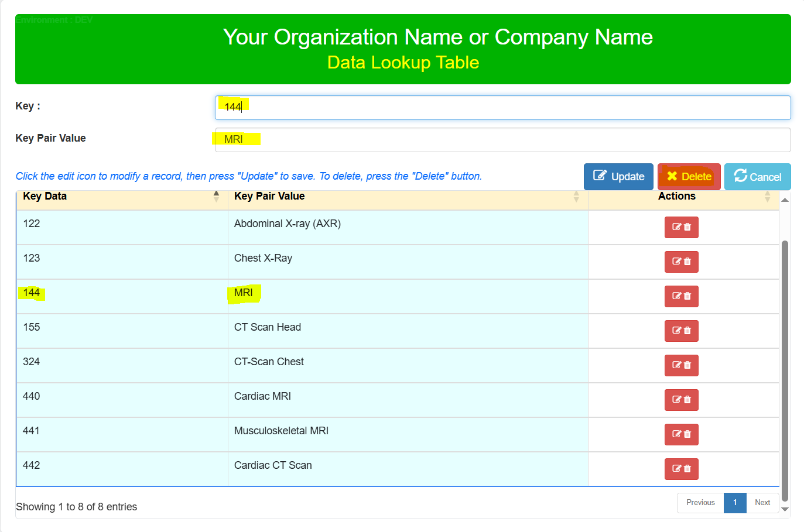
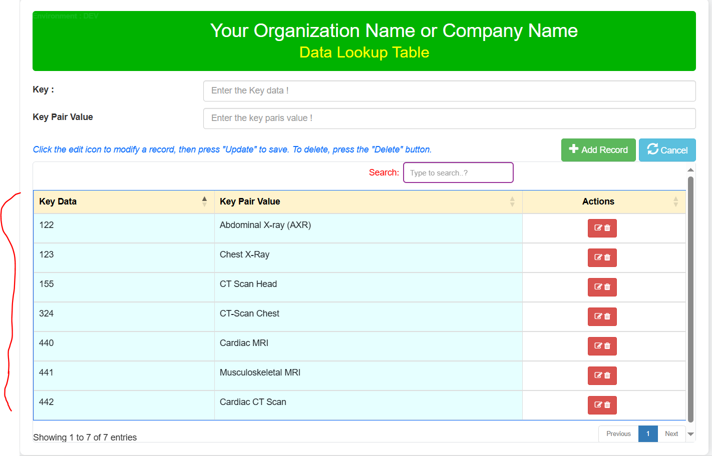
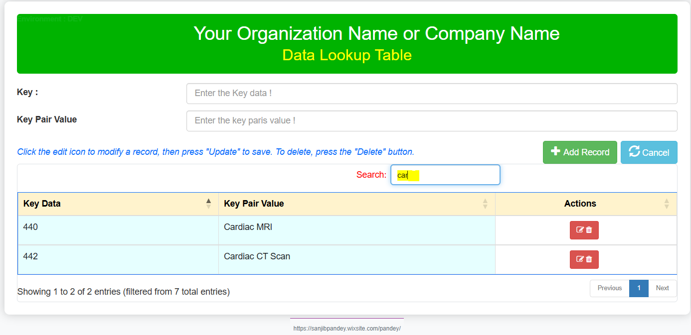

# Reusable-Web-Interface-for-Data-Lookup-Table
A Reusable Web Interface and Class for Maintaining Data Lookup Tables in HealthConnect.
## Overview
This web interface is designed to facilitate the management of Data Lookup Tables via a user-friendly web page. It is particularly useful when your lookup table values are large, dynamic, and frequently changing. By granting end-users controlled access to this web interface (read, write, and delete permissions limited to this page), they can efficiently manage lookup table data according to their needs.
The data managed through this interface can be seamlessly utilized in HealthConnect rules or data transformations, eliminating the need for constant manual monitoring and management of the lookup tables and thereby saving significant time.

🚨 **Note:** If the standard Data Lookup Table does not meet your mapping requirements, you can create a custom table and adapt this web interface along with its supporting class with minimal modifications. Sample class code is available upon request.

### 🧩 Prerequisite: Create a Data Lookup Table in HealthConnect

Before using the web interface, ensure you have created an empty **Data Lookup Table** in **HealthConnect**:

1. Navigate to **Interoperability → Configure → Data Lookup Tables**.  
2. Click **New** to open the *Create New Lookup Table* popup.  
3. Enter the desired name for your lookup table and click **OK**.  
4. Click **Save** to finalize table creation.  
5. Verify the lookup table creation by clicking **Open** in the same window — your new table should appear in the list.  

> 💡 **Example:**  
> The sample Data Lookup Table name used in this documentation is  
> **`Example of data lookup table`**

### 🚀 Usage Instructions

The setup process is straightforward:

1. **Obtain the code:**  
   Download the provided code from the GitHub repository or copy it from the community link.

2. **Create a CSP page:**  
   Create a new CSP page in your HealthConnect environment and paste the entire code from the `DataLookupWebApp` file.

3. **Create a class:**  
   Copy and paste the class code provided in the documentation or repository.

### ⚙️ Configuration

Before compiling and running:

- Replace the placeholder for your **Data Lookup Table** name on the web page (indicated by the red box in the screenshot below) with your actual lookup table name.

- Ensure the class name in the code matches your custom class name.

  

-	Assign your lookup table name in the class, where indicated by myDtName = 'your data lookup table'. See screenshot above.

## ✅ Compile both the class and the CSP page to finalize the setup.

### 🧪 Testing the Application

#### Adding Records

- Enter the key and corresponding key-value pair in the form fields.  
- Click **Add Record** (122 - Spine X-ray) to insert the data into the lookup table.

**Screenshot 1: Adding Records**  

####  Updating Records
-	Select an existing record and modify the key-value pair as needed.
  

-  Click Update to save changes. 
Example: Updating "122 - Spine X-ray" to "Abdominal X-ray (AXR)".

#### Deleting Records
-	Select the record to delete (144 – MRI)

-	Click the Delete button to remove the record from the lookup table.
Example: Deleting "144 - MRI".

- Example of Serch Record

#### 🔍 Check Data Lookup Table in HealthConnect

To verify the records in your lookup table:

1. Navigate to **Interoperability → Configure → Data Lookup Tables**.  
2. Click **Open** to view the contents of your lookup table.

### 💾 Code / Resources

- The full source code is available on [GitHub](#) for download and reference.

### 🏁 Conclusion

This reusable web interface and class provide a simple yet effective way to manage **Data Lookup Tables** in **HealthConnect**, enhancing both efficiency and flexibility. By empowering end-users with controlled access, it reduces the administrative overhead traditionally associated with lookup table maintenance.

💬 **Thank you 
